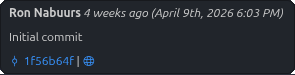

# git-blame-hover

Show Git commit blame details on hover, with clickable commit links and a quick diff view for each commit.

## Features

- Hover any line in a file tracked by Git to see:
	- Commit author
	- Commit date (relative and absolute, e.g. _5 years ago (September 7th, 2020 3:38 PM)_)
	- Commit message
	- Short commit SHA as a clickable link to open the commit diff in VS Code
	- Globe icon link to view the commit in your remote (GitHub, GitLab, or self-hosted)

## Usage

Just install and reload. Hover any committed line in a Git-tracked file to see blame info and links.

Click the commit SHA to open a diff of the commit in VS Code.

Click the globe icon to open the commit in your remote repository (supports GitHub, GitLab, and self-hosted variants).

## Requirements

- Requires Git to be installed and available in your PATH.
- Requires the built-in VS Code Git extension (enabled by default).

## Extension Commands

- `git-blame-hover.openCommitChanges`: Opens the diff view for a specific commit. (Used internally by the hover link.)

## Development & Testing

- Run `npm install` to install dependencies.
- Run `npm test` to execute all unit tests.
- Run the extension in a VS Code Extension Development Host to try it live.
